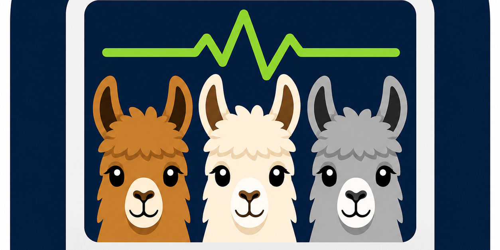

# Llama Monitor

<table>
  <tr>
    <td width="58%">
      
    </td>
    <td valign="top" style="padding-left: 1.5rem;">
      <p><strong>Local model status at a glance.</strong> Llama Monitor keeps tabs on Ollama, health endpoints, chat servers, and local launchd agents from a single page so you can quickly see which services are up, which models are loaded, and whether a model restart is needed.</p>
    </td>
  </tr>
</table>

This is a local model-service status page that allows monitoring of various local AI model services like Ollama, health endpoints, and chat servers.

## Setup

1. First, determine what model servers are running on your machine:
   - Check for Ollama: `ollama list` or `launchctl list | grep -i ollama`
   - Check listening ports: `lsof -iTCP -sTCP:LISTEN`

2. Update `services.json` to match your running services

3. Run the setup validation:
   ```bash
   python3 requirements-check || pip3 install -r requirements.txt
   ./check.py
   ```

4. Finally, run the monitor:
   ```bash
   ./run.sh
   ```

The monitor will be available at `http://<machine>:7779/`. Access is open by
default; to require a shared token again, start it with
`MONITOR_TOKEN='<long random string>' ./run.sh` (HTTP Basic, any username,
token as password).

## Services Configuration

The `services.json` file defines what services to monitor:

- `ollama`: Ollama server; probes `/api/tags` + `/api/ps`; `model` is the assigned model name shown as Assigned/Loaded
- `health`: any OpenAI-compatible local server exposing `/health` with `{"model": ..., "context_window": ...}`
- `chat`: a chat server exposing `/api/models` (the chatLlama backend); probed over HTTPS with certificate verification off
- `http`: plain reachability probe of `url`; any 2xx counts as up
- `launchd` (optional, any card): LaunchAgent label — shows Agent state and Start/Stop buttons; a stop disables the agent (stays stopped across reboots) until Start is pressed

## Files

- `services.json` - Configuration file defining what services to monitor
- `check.py` - Validation script that checks service configuration and connectivity
- `run.sh` - Main run script for the monitor server
- `requirements-check` - Script to check Python dependencies
